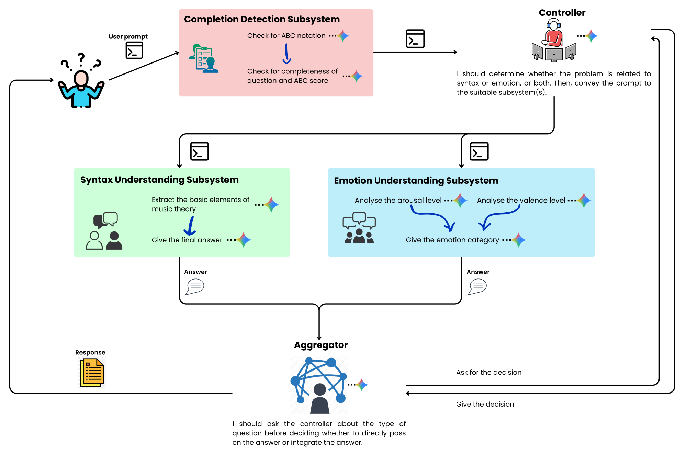
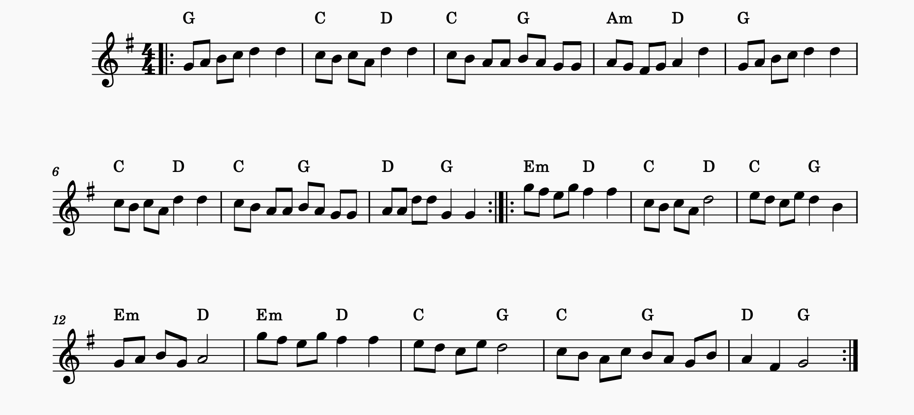

# M.U.S.E.

### Multi-Agent Symbolic Music Understanding with LLMs

**Qicheng Jin · Chenqi Wang · Chenxi Peng**<br>
University of Chicago

[Read the paper](docs/paper/MUSE-paper.pdf) · [Explore the implementation](src/music_agent/system.py) · [System documentation](docs/SYSTEM_DOCUMENTATION.md)

M.U.S.E. is a multi-agent system that helps large language models reason about
symbolic music written in [ABC notation](https://abcnotation.com/). Instead of
asking one model to parse a score and solve a music question at the same time,
M.U.S.E. separates input validation, task routing, score analysis, musical
reasoning, and response aggregation into specialized agents.

Our experiments on the ABC-Eval benchmark show that this decomposition improves
both low-level syntax understanding and high-level emotion recognition - without
retraining the underlying LLM or relying on external music-processing tools.

## System overview



The system first checks that the user supplied a complete ABC score and a valid
question. A controller then routes the request to one or both specialized
subsystems:

| Component | Responsibility |
|---|---|
| **Completion Detection** | Extracts ABC notation and validates score/question completeness |
| **Controller Agent** | Routes each request to `ABC`, `EMOTION`, or `BOTH` |
| **Syntax Understanding** | An ABC Score Expert parses the score; an Evaluator answers the question from that analysis |
| **Emotion Understanding** | Independent analyst groups estimate arousal and valence; an Emotion Combiner maps them to a final category |
| **Aggregator Agent** | Returns one subsystem response or combines both into a coherent answer |

This modular design makes each reasoning stage traceable, allows new musical
capabilities to be added independently, and reduces the burden placed on any
single model call.

## From symbolic score to musical meaning

ABC notation represents music as discrete symbols for pitch, duration, meter,
key, chords, and bar structure. The example below is the conventional score
rendering of an ABC input used throughout the paper.



M.U.S.E. addresses two complementary levels of understanding:

- **Syntax understanding:** key, meter, note length, chord symbols, bar
  structure, and related metadata questions.
- **Emotion understanding:** a four-quadrant valence-arousal model - happy
  (Q1), angry (Q2), sad (Q3), and relaxed (Q4).

For emotion recognition, three independent Arousal Analysts and three Valence
Analysts vote on `HIGH` or `LOW` for each dimension. The Emotion Combiner then
maps the two-dimensional result to the final category. This reframes a difficult
four-way decision as two simpler, interpretable judgments.

## Evaluation

We evaluate M.U.S.E. on two representative tasks from
[ABC-Eval](https://anonymous.4open.science/r/ABC-Eval-B622):

| Task | Understanding level | Evaluation size |
|---|---|---:|
| Metadata Q&A | Basic syntax | 60 |
| Emotion Recognition | Sequence-level semantics | 100 |

The study compares standalone inference with the corresponding M.U.S.E.
subsystem using two open-weight instruction models:
`Meta-Llama-3.1-70B-Instruct` and `gemma-3-27b-it`.

### Results

| Task | LLaMA · LLM | LLaMA · Agent | Gemma · LLM | Gemma · Agent |
|---|---:|---:|---:|---:|
| Controller | N/A | **100%** | N/A | **100%** |
| Metadata Q&A | 61.67% | **98.33%** | 98.33% | **98.33%** |
| Emotion Recognition | 14.00% | **38.00%** | 18.00% | **53.30%** |
| └ Arousal | 38.00% | **60.00%** | 34.00% | **76.67%** |
| └ Valence | 40.00% | **58.00%** | 59.00% | **60.00%** |

All figures above are taken from the evaluation table in the project paper.

### Key findings

- **Agentic decomposition closes the model-capability gap.** On Metadata Q&A,
  the LLaMA-based system rises from 61.67% to 98.33%, matching the
  Gemma-based agent and answering 59 of 60 questions correctly.
- **Emotion benefits from structured reasoning.** M.U.S.E. improves four-way
  emotion accuracy from 14.00% to 38.00% with LLaMA and from 18.00% to 53.30%
  with Gemma.
- **Arousal shows the strongest gain.** Gemma improves from 34.00% to 76.67%
  when arousal is handled as an explicit intermediate decision.
- **Routing is reliable in the study setting.** Both models classify all 100
  generated controller test queries correctly.

## Why it works

For Metadata Q&A, the ABC Score Expert first produces a structured analysis of
the score, and the Evaluator reasons only from that analysis. Separating parsing
from question answering makes the task more manageable and the model's behavior
more interpretable.

For emotion recognition, M.U.S.E. avoids asking the model to jump directly to a
subjective label. It separately evaluates rhythmic and textural cues for arousal
and harmonic, modal, and melodic cues for valence before combining them. The
results suggest that this structure better matches how LLMs reason about
symbolic musical information.

## Limitations and future work

Emotion recognition remains substantially harder than syntax understanding.
Arousal is often visible in rhythmic density and motion, while valence depends
on subtler harmonic and long-range melodic context. In addition, emotion labels
come from human annotation and can admit multiple musically reasonable
interpretations.

Future work will explore soft-label emotion annotations based on broader human
studies and extend the modular system to harmony analysis, bar sequencing, genre
detection, and symbolic music generation.

## Run the prototype

The current implementation targets the ALCF OpenAI-compatible inference service
and requires an eligible Globus identity.

```bash
git clone https://github.com/QiChengJin/Agent-for-symbolic-music-understanding.git
cd Agent-for-symbolic-music-understanding

python -m venv .venv
source .venv/bin/activate
pip install -e .

python -m music_agent.auth authenticate
python -m music_agent.system
```

The repository separates the importable system (`src/music_agent`), experiment
variants (`experiments`), benchmark data (`data`), recorded outputs (`results`),
and the complete paper materials (`docs/paper`).

## Resources

- [Full project paper](docs/paper/MUSE-paper.pdf)
- [Detailed system and prompt documentation](docs/SYSTEM_DOCUMENTATION.md)
- [ABC-Eval benchmark](https://anonymous.4open.science/r/ABC-Eval-B622)
- [EMelodyGen paper](https://arxiv.org/abs/2309.13259)
- [EMelodyGen dataset](https://huggingface.co/datasets/monetjoe/EMelodyGen)
